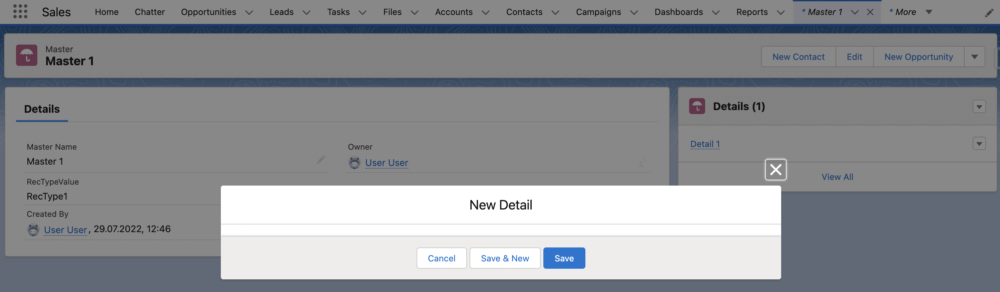
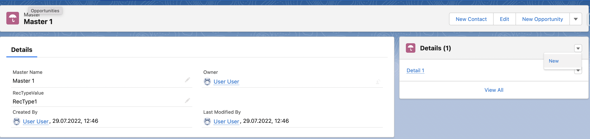
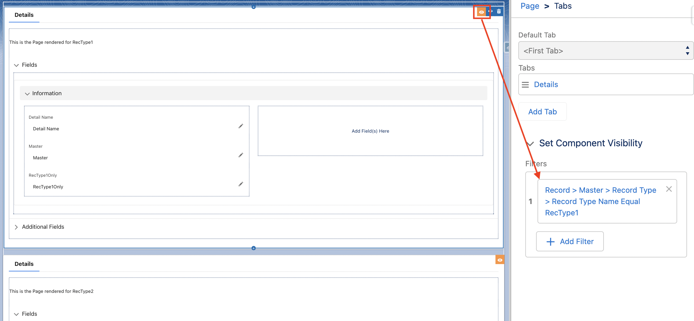
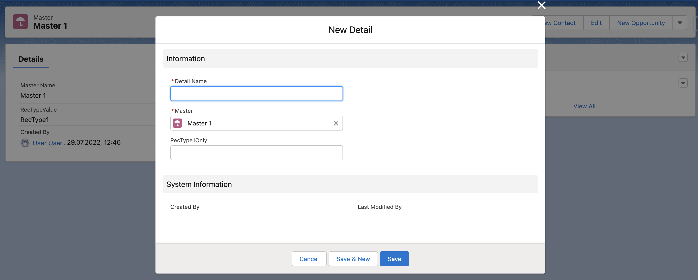

# Issue
This repo demonstrates an issue where the "New Record" dialog is not displaying fields when launched from a related list. 

It's very likely to run into this when 
- you have a Master-Detail relationship
- you have record types on the Master
- you want to display different information on the Detail record page depending on the record type of the master

# Steps to reproduce

Be sure your DevHub is authenticated. Paste below commands to your terminal in the working directory of this cloned repo:

`sfdx force:org:create -f config/project-scratch-def.json --setalias new-dialog-test --durationdays 7 --setdefaultusername &&
sfdx force:source:push &&
sfdx force:user:permset:assign --permsetname Dev &&
sfdx force:apex:execute -f scripts/apex/create_data.apex &&
sfdx force:org:open -p "lightning/o/Master__c/list?filterName=All"`

Open "Master 1", find the related list, click on the arrow button next to "Details (1), click "New".

Open "Details 1" from the same to validate that the page renders correctly.

# Explanation
Given a Master-Detail between two custom objects "Master" and "Detail" whereas Master has two record types "RecType1" and "RecType2".

The Detail Lightning Record Page uses visibility filters depending on those record types: the first section is only visible for RecType1, the second only for RecType2:

This logic works and can be validated when opening "Details 1" record on the "Master 1" record. As a Detail record can't exist without the Master, the relationship in the filter is correct.

But this breaks in the "New" dialog in the related list: the Master record is *null* and therefore all fields are hidden as none of the filters apply!

# Expected Behavior
Visibility filters should respect the context from where the dialog is opened as a Detail record is always in the context of the Master. This same logic applies to the lookup field which can be seen when removing the first filter: the lookup is pre-filled!

